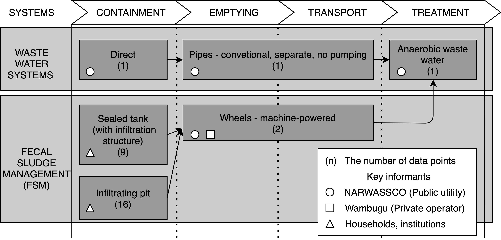
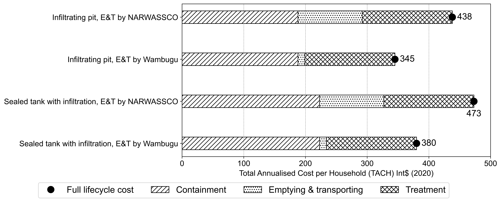

# cactus-narok-figures

This repository is to manage figures for the cost paper of urban sanitation systems in Narok town, Kenya.

## List of Figures

- Figure1 Cost data points collected for Narok Town by CACTUS Component (Sainati et al., 2020) for wastewater and fecal sludge management systems. The numbers in brackets show the number of data points by component.

- Figure2 Excreta flows in Narok Town in 2022 derived from interviews and secondary data 

- Figure 3 Distribution of cost liability of conventional separate sewers with no pumping in Narok Town expressed in terms of Total Annualised Cost per Household (TACH)

- Figure 4 Distribution of cost liability of Limanet Wastewater Treatment Plant in Narok Town expressed in terms of Total Annualised Cost per Household (TACH)

- Figure 5 Total annualised cost of mechanical emptying and transport for two providers in Narok Town, NARWASSCO (publicly owned) and Wambugu (privately owned). Plates a) and b) show cost breakdown for each major cost category. Cost breakdowns by subcategory are shown in plates (c) Direct CAPEX, (d) Indirect CAPEX, (e), Direct OPEX and (f) Indirect OPEX

- Figure 6 The full lifecycle cost (Int$2020) of the faecal sludge management (FSM) system across the sanitation value chain. The bar charts compare the Total Annualised Cost per Household (TACH) for infiltrating pit and septic tank between public utility (NARWASSCO) and private operator (Wambugu). The circle markers show the total costs for each class.

- Figure 7 The whole-system TACH (Int$ (2020)) of sewerage for Narok Town plotted against sewer connectivity. The bar chart illustrates the proportion of the costs of each stage at the sanitation value chain, and the line chart shows the total cost in accordance with the sewer connectivity changes. The data table shows TACH values by component in each case.

- Figure 8 Total Annualised Cost of onsite sanitation containments in Narok Town (Int$ 2020) (a) per household (TACH) (b) per capita (TACC), and the trendline of toilet cost against the number of households served (c) and the number of people served.  

- Figure 9 Total Annualised Cost per Household (TACH) Int$ (2020) by component for Narok town (mean values shown as star icons), compared to the CACTUS database (full data range shown as boxplots) in September 2022.

- Figure 10 Total Annualised Cost per Household (TACH) (Int$ (2020)) for whole sanitation systems for Narok town (box plots) compared to the CACTUS database (bars) in September 2022  

## License

The source code is MIT License. The figures and texts attached in the repo is under CC By 4.0 License.
