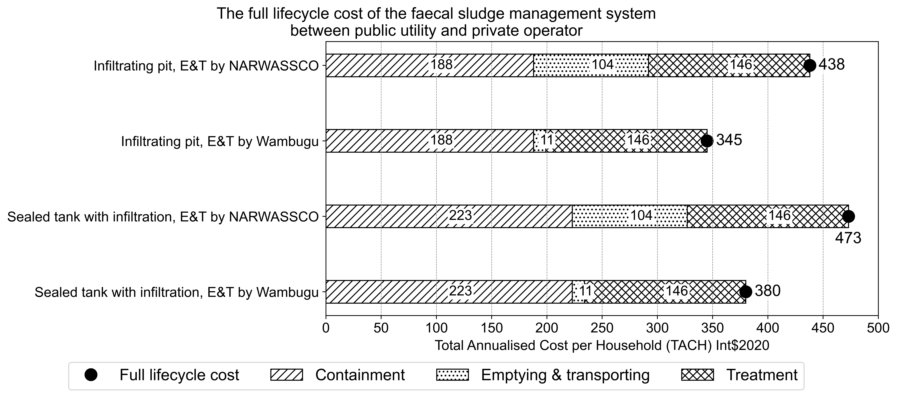
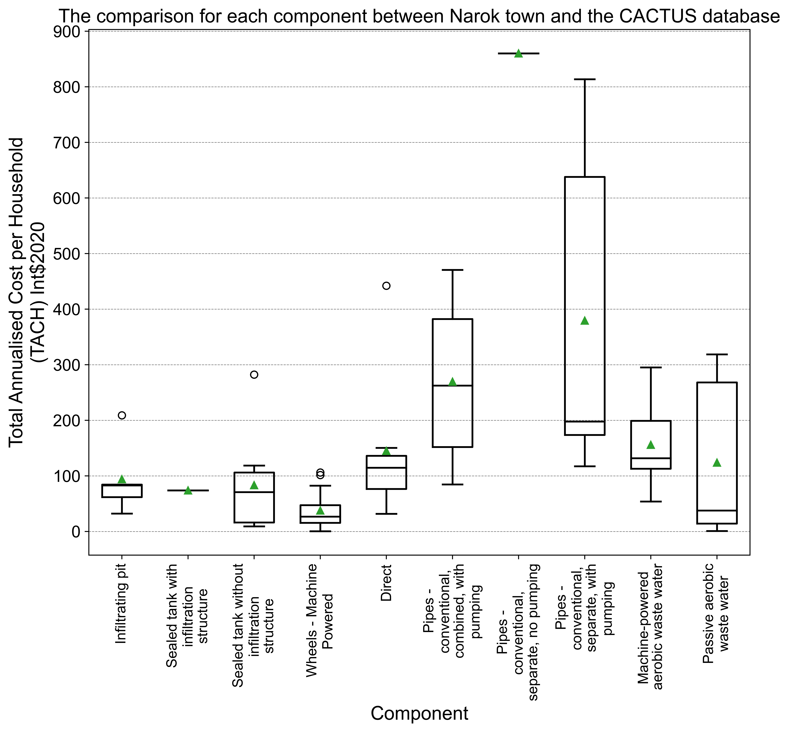

# cactus-narok-figures

This repository is to manage figures for the cost paper of urban sanitation systems in Narok town, Kenya.

## List of Figures

- Figure 3-3 The proportion of Total Annualised Cost per Household (TACH) for each category of sewer pipes without pumping. The pie chart (a) shows the proportion of TACH for each cost category (Direct/Indirect CapEx and Direct/Indirect OpEx), and the bar chart (b) presents the proportion of breaking down cost items for each category

- Figure 3-4 The proportion of Total Annualised Cost per Household (TACH) Int$2020 for each category of Limanet wastewater treatment plant in Narok town. The pie chart (a) shows the proportion of TACH for each cost category (Direct/Indirect CapEx and Direct/Indirect OpEx), and the bar chart (b) presents the proportion of breaking down cost items for each category

- Figure3-5 The plots of Total Annualised Cost per Household (TACH) and Total Annualised Cost per Capita (TACC) in faecal sludge management (FSM) components of infiltrating pit and sealed tank with infiltration (Int$2020). The top half of the box plot shows the TACH (a) and TACC (b) fractions, while the bottom half shows how the TACH (c) and TACC (d) are plotted against the number of households and population served.

- Figure3-6 The comparison of total annualised costs of mechanical emptying and transporting between public utility (NARWASSCO) and private operator (Wambugu). a) and b) shows the proportion for each major category. The detailed comparison at the sub category are presented at Direct CapEx (c), Indirect CapEx (d), Direct OpEx (e) and Indirect OpEx (f).

- Figure3-7 The full lifecycle cost  (Int$2020) of the sewage system for the entire sanitation value chain against the improvement of the sewer connectivity. The bar chart illustrates the proportion of the costs of each stage at the sanitation value chain, and the line chart shows the total cost in accordance with the sewer connectivity changes. The diagram starts with the present value in June 2022 and ends with when the connectivity reaches the design capacity of the system (3,500m3 per day). The data table below the chart summarise the Total annualised costs per household (TACH) values for each stage and sewer connectivity.

- Figure3-8 The full lifecycle cost (Int$2020) of the faecal sludge management (FSM) system across the sanitation value chain. The bar charts compare the Total Annualised Cost per Household (TACH) for infiltrating pit and septic tank between public utility (NARWASSCO) and private operator (Wambugu). The circle markers show the total costs for each class.

- Figure4-1 The comparison of full lifecycle costs (Int$ 2020) between the CACTUS database and Narok town as of September 2022. The faecal sludge management (FSM) systems' lifecycle costs are shown in the left side of vertical line, and the sewage systems' cost are presented in the other side. The boxplots show the minimum and maximum TACH of Narok town's cost for FSM and sewage.

- The comparison of Total Annualised Cost per Household (TACH) (Int$ 2020) between the CACTUS database and Narok town as of September 2022. The box plots present the range of TACH for each component except Narok town. Star icons are the cost of Narok town for each component. The components on the left side are for the faecal sludge management system, and on the other side are for sewage systems.

## License

The source code is MIT License. The figures and texts attached in the repo is under CC By 4.0 License.
